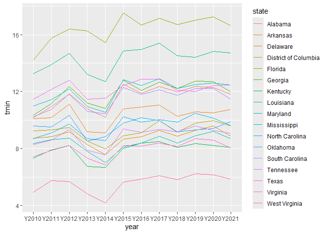
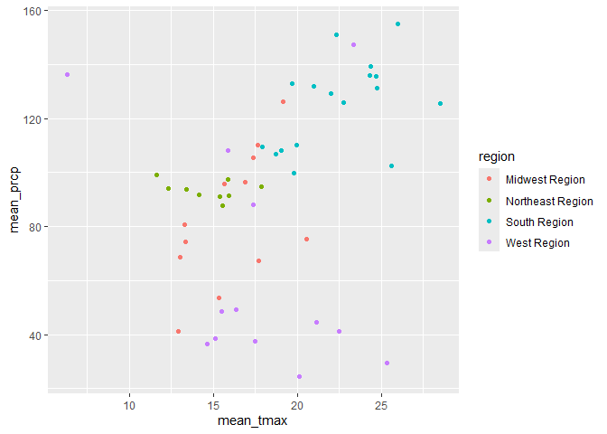

# Geog4/6300: Lab 1


## Loading data into R, data transformation, and summary statistics

**Your name: Selena Centeno**

**Overview and lab criteria:**

This lab is intended to assess your ability to use R to load data and to
generate basic descriptive statistics. For this lab to be marked
complete, the following criteria must be met:

4.  Identify and apply appropriate data filtering and cleaning
    strategies to prepare datasets for analysis. (Task 2)
5.  Effectively interpret the code you create, explaining in plain
    language what each step does to the data. (Task 6)
6.  Identify and use appropriate external documentation — including
    package references, help files, and peer resources — to learn and
    apply unfamiliar functions or methods. (Task 7)
7.  Filter, aggregate, and transform datasets using grouping and summary
    operations to answer specific analytical questions. (Tasks 1 & 5)
8.  Reshape data between wide and long formats to meet the requirements
    of different analytical or visualization tasks. (Task 4)
9.  Create effective data visualizations across multiple chart types
    (line, scatter, histogram, Q-Q plot), applying appropriate aesthetic
    choices such as color, grouping, and labeling. (Task 3 & 5)

**Data:**

You’ll be using monthly weather data from the Daymet climate database
(http://daymet.ornl.gov) for all counties in the United States over an
12-year period (2010-2021). These data are available on the GitHub repo
for our course. The following variables are provided:

- `cty_txt`: Code for joining to census data
- `year`: Year of observation (with an initial “Y” to make it a
  character)
- `month`: Month of observation (1 = Jan, 2 = Feb, etc.)
- `median_tmax`: Median maximum recorded temperature (Celsius)
- `median_tmin`: Median minimum recorded temperature (Celsius)
- `sum_prcp`: Total recorded precipitation for the month (mm)
- `cty_name`: Name of the county
- `state`: State of the county
- `region`: Census region (map:
  https://www2.census.gov/geo/pdfs/maps-data/maps/reference/us_regdiv.pdf)
- `division`: Census division
- `X`: Longitude of the county centroid
- `Y`: Latitude of the county centroid

These labs are meant to be done collaboratively, but your final
submission should demonstrate your own original thought (don’t just copy
your classmate’s work or turn in identical assignments). Your answers to
the lab questions should be typed in this Quarto template. You’ll then
render the document to a GitHub markdown document and upload it to your
class GitHub repo.

**Procedure:**

Load the tidyverse package and import the data:

``` r
#Importing the data:
library(tidyverse)

daymet_data <- read_csv("data/daymet_monthly_median_2010-2021.csv")
```

We can look at the first few rows of the dataset using the *head()*
function. We also use *kable* to format the output as a readable table..

``` r
kable(head(daymet_data))
```

| cty_txt | year | month | median_tmax | median_tmin | sum_prcp | cty_name | state | region | division | x | y |
|:---|:---|---:|---:|---:|---:|:---|:---|:---|:---|---:|---:|
| G02060 | Y2010 | 1 | -4.27 | -10.83 | 10.04 | Bristol Bay | Alaska | West Region | Pacific Division | -156.7011 | 58.74213 |
| G02185 | Y2010 | 1 | -20.73 | -28.20 | 0.00 | North Slope | Alaska | West Region | Pacific Division | -153.4411 | 69.30696 |
| G02180 | Y2010 | 1 | -16.50 | -23.72 | 5.75 | Nome | Alaska | West Region | Pacific Division | -163.9703 | 64.89492 |
| G02050 | Y2010 | 1 | -11.20 | -18.90 | 24.55 | Bethel | Alaska | West Region | Pacific Division | -159.7678 | 60.92187 |
| G02261 | Y2010 | 1 | -13.93 | -20.03 | 15.84 | Valdez-Cordova | Alaska | West Region | Pacific Division | -144.4573 | 61.57080 |
| G02170 | Y2010 | 1 | -5.10 | -12.42 | 35.84 | Matanuska-Susitna | Alaska | West Region | Pacific Division | -149.5702 | 62.31653 |

There are a lot of observations here, 452,448 to be exact. To get a
better grasp on the data, we can use `group_by()` and `summarise()` from
the tidyverse package. This will allow us to identify the mean value for
each year by county across the study period.

## Task 1

*Use `group_by()` and `summarise()` to calculate the mean minimum
temperature for each year by county across all months, also including
State and Region as grouping variables. Your resulting dataset should
show the value of tmin for each county in each year. Use the `kable()`
and `head()` functions as shown above to call the resulting table.*

``` r
tmin_yearly <- daymet_data %>%
  group_by(cty_name, state, region, year) %>%
  summarise(tmin = mean(median_tmin, na.rm = TRUE))
```

    `summarise()` has regrouped the output.
    ℹ Summaries were computed grouped by cty_name, state, region, and year.
    ℹ Output is grouped by cty_name, state, and region.
    ℹ Use `summarise(.groups = "drop_last")` to silence this message.
    ℹ Use `summarise(.by = c(cty_name, state, region, year))` for per-operation
      grouping (`?dplyr::dplyr_by`) instead.

``` r
#na.rm tells R to ignore any "NA" values in the dataset. 
kable(head(tmin_yearly))
```

| cty_name  | state          | region       | year  |      tmin |
|:----------|:---------------|:-------------|:------|----------:|
| Abbeville | South Carolina | South Region | Y2010 | 10.009167 |
| Abbeville | South Carolina | South Region | Y2011 | 10.515417 |
| Abbeville | South Carolina | South Region | Y2012 | 11.589167 |
| Abbeville | South Carolina | South Region | Y2013 |  9.980833 |
| Abbeville | South Carolina | South Region | Y2014 |  9.876667 |
| Abbeville | South Carolina | South Region | Y2015 | 11.799167 |

## Task 2

*Let’s shift to the state level, focusing on those in the South Region.
Filter the original data frame (`daymet_data`) to just include counties
in this region. Then calculate the mean minimum temperature by year for
each state. For an optional extra challenge, use the `round()` function
to include only 1 decimal point. Use `kable()` and `head()` to call the
first few lines of the resulting table.*

``` r
#Filtering the dataframe to only include countries in the south region using the filter() function. Then, using the groupby function to organize based on states and year. Then, calculating the mean for each group from from the median_tmin column.
southregion_tmin<- daymet_data %>%
  filter(region == "South Region") %>%
  group_by(state, year) %>%
  summarise(tmin=mean(median_tmin, na.rm = TRUE))
```

    `summarise()` has regrouped the output.
    ℹ Summaries were computed grouped by state and year.
    ℹ Output is grouped by state.
    ℹ Use `summarise(.groups = "drop_last")` to silence this message.
    ℹ Use `summarise(.by = c(state, year))` for per-operation grouping
      (`?dplyr::dplyr_by`) instead.

``` r
#Extra Challenge Part below.
southregion_tminchallenge <- daymet_data %>%
  filter(region == "South Region") %>%
  group_by(state, year) %>%
  summarise(tmin = round(mean(median_tmin, na.rm = TRUE), 1))
```

    `summarise()` has regrouped the output.
    ℹ Summaries were computed grouped by state and year.
    ℹ Output is grouped by state.
    ℹ Use `summarise(.groups = "drop_last")` to silence this message.
    ℹ Use `summarise(.by = c(state, year))` for per-operation grouping
      (`?dplyr::dplyr_by`) instead.

``` r
kable(head(southregion_tminchallenge))
```

| state   | year  | tmin |
|:--------|:------|-----:|
| Alabama | Y2010 | 10.2 |
| Alabama | Y2011 | 10.7 |
| Alabama | Y2012 | 11.8 |
| Alabama | Y2013 | 10.8 |
| Alabama | Y2014 | 10.2 |
| Alabama | Y2015 | 12.5 |

## Task 3

*To visualize the trends, we could use ggplot to visualize change in
mean temperature over time. Create a line plot (`geom_line`) showing the
state means you calculated in task 2. Use the `color` parameter to show
separate colors for each state. You may also need to define the state as
a group in the aesthetic parameter.*

``` r
#Making pretty plot 
ggplot(southregion_tmin, aes(x = year, y = tmin, color = state, group = state)) +
  geom_line()
```



## Task 4

*If you wanted to look at these data as a table, you’d need to have it
in wide format. Use the `pivot_wider()` function to create a wide-format
version of the data frame you created in task 2. In this case, the rows
should be states, the columns should be the years, and the data in those
columns should be mean minimum temperatures. Then call the whole table
using `kable()`.*

``` r
southregion_tmin_wide <- southregion_tmin %>%
  pivot_wider(names_from = year, values_from = tmin)

kable(southregion_tmin_wide)
```

| state | Y2010 | Y2011 | Y2012 | Y2013 | Y2014 | Y2015 | Y2016 | Y2017 | Y2018 | Y2019 | Y2020 | Y2021 |
|:---|---:|---:|---:|---:|---:|---:|---:|---:|---:|---:|---:|---:|
| Alabama | 10.245510 | 10.734901 | 11.833694 | 10.790093 | 10.189751 | 12.543626 | 11.866754 | 12.359185 | 11.990535 | 12.341113 | 12.285535 | 11.803215 |
| Arkansas | 10.079350 | 10.169006 | 11.119139 | 9.174078 | 9.112750 | 10.780661 | 10.927544 | 11.046489 | 10.279783 | 10.576967 | 10.509972 | 10.749478 |
| Delaware | 8.710000 | 8.837778 | 9.178194 | 8.275417 | 7.555417 | 8.657917 | 8.832361 | 9.269167 | 8.847917 | 9.268194 | 9.571944 | 8.871806 |
| District of Columbia | 9.231250 | 9.299584 | 9.466667 | 8.518750 | 7.978333 | 8.896667 | 9.101250 | 9.960834 | 9.126250 | 9.791250 | 9.969583 | 9.590000 |
| Florida | 14.193762 | 15.752463 | 16.399621 | 16.247929 | 15.448762 | 17.515896 | 16.680100 | 17.161580 | 16.688346 | 17.009061 | 17.245578 | 16.628458 |
| Georgia | 10.347883 | 11.170511 | 12.355335 | 11.202432 | 10.818304 | 12.789607 | 12.087993 | 12.650435 | 12.221292 | 12.729167 | 12.686963 | 11.995301 |
| Kentucky | 7.313726 | 7.892549 | 8.214351 | 6.749837 | 6.659774 | 8.019806 | 8.387410 | 8.477073 | 8.075319 | 8.359674 | 8.207757 | 8.075701 |
| Louisiana | 13.248724 | 13.880033 | 14.680664 | 13.202969 | 12.699922 | 14.846419 | 14.964766 | 15.401602 | 14.524740 | 14.407923 | 14.834108 | 14.709909 |
| Maryland | 8.334948 | 8.623281 | 8.734462 | 7.787986 | 7.008941 | 8.107795 | 8.392500 | 8.864080 | 8.396684 | 8.914427 | 9.219514 | 8.681406 |
| Mississippi | 10.984035 | 11.431438 | 12.168389 | 10.967403 | 10.530401 | 12.839426 | 12.409924 | 12.919746 | 12.203547 | 12.507703 | 12.597368 | 12.446601 |
| North Carolina | 8.675038 | 9.117442 | 9.727054 | 8.707479 | 8.566662 | 10.239342 | 9.841467 | 10.016312 | 9.853292 | 10.471858 | 10.136233 | 9.622996 |
| Oklahoma | 9.568831 | 9.515498 | 10.350790 | 8.527890 | 8.813268 | 9.778474 | 10.167760 | 9.960471 | 9.157338 | 9.294513 | 9.413074 | 9.877798 |
| South Carolina | 10.163052 | 10.959121 | 11.818397 | 10.616196 | 10.428043 | 12.299964 | 11.791630 | 12.105616 | 11.755770 | 12.227527 | 12.211504 | 11.453342 |
| Tennessee | 8.279781 | 8.572684 | 9.359118 | 7.862009 | 7.575233 | 9.361088 | 9.147855 | 9.333417 | 9.175232 | 9.573070 | 9.262618 | 9.062390 |
| Texas | 11.478857 | 12.157956 | 12.815773 | 11.474339 | 11.538154 | 12.421132 | 12.880901 | 12.882920 | 12.072930 | 12.009859 | 12.420048 | 12.474040 |
| Virginia | 7.409715 | 7.880649 | 8.217077 | 7.327907 | 6.839179 | 8.209383 | 8.169474 | 8.376147 | 8.159727 | 8.686776 | 8.600852 | 8.050179 |
| West Virginia | 4.910909 | 5.756598 | 5.662424 | 4.829826 | 4.189849 | 5.642818 | 5.866697 | 6.098197 | 5.799614 | 6.241008 | 6.157992 | 5.836871 |

``` r
#Looks nice. Rows are the states and columns are years. I'm going to make the mean tmin temps rounded like I did in Task 2!

southregion_tminchallengewide <- southregion_tmin %>%
  mutate(tmin = round(tmin, 1)) %>%
  pivot_wider(names_from = year, values_from = tmin)

kable(southregion_tminchallengewide)
```

| state | Y2010 | Y2011 | Y2012 | Y2013 | Y2014 | Y2015 | Y2016 | Y2017 | Y2018 | Y2019 | Y2020 | Y2021 |
|:---|---:|---:|---:|---:|---:|---:|---:|---:|---:|---:|---:|---:|
| Alabama | 10.2 | 10.7 | 11.8 | 10.8 | 10.2 | 12.5 | 11.9 | 12.4 | 12.0 | 12.3 | 12.3 | 11.8 |
| Arkansas | 10.1 | 10.2 | 11.1 | 9.2 | 9.1 | 10.8 | 10.9 | 11.0 | 10.3 | 10.6 | 10.5 | 10.7 |
| Delaware | 8.7 | 8.8 | 9.2 | 8.3 | 7.6 | 8.7 | 8.8 | 9.3 | 8.8 | 9.3 | 9.6 | 8.9 |
| District of Columbia | 9.2 | 9.3 | 9.5 | 8.5 | 8.0 | 8.9 | 9.1 | 10.0 | 9.1 | 9.8 | 10.0 | 9.6 |
| Florida | 14.2 | 15.8 | 16.4 | 16.2 | 15.4 | 17.5 | 16.7 | 17.2 | 16.7 | 17.0 | 17.2 | 16.6 |
| Georgia | 10.3 | 11.2 | 12.4 | 11.2 | 10.8 | 12.8 | 12.1 | 12.7 | 12.2 | 12.7 | 12.7 | 12.0 |
| Kentucky | 7.3 | 7.9 | 8.2 | 6.7 | 6.7 | 8.0 | 8.4 | 8.5 | 8.1 | 8.4 | 8.2 | 8.1 |
| Louisiana | 13.2 | 13.9 | 14.7 | 13.2 | 12.7 | 14.8 | 15.0 | 15.4 | 14.5 | 14.4 | 14.8 | 14.7 |
| Maryland | 8.3 | 8.6 | 8.7 | 7.8 | 7.0 | 8.1 | 8.4 | 8.9 | 8.4 | 8.9 | 9.2 | 8.7 |
| Mississippi | 11.0 | 11.4 | 12.2 | 11.0 | 10.5 | 12.8 | 12.4 | 12.9 | 12.2 | 12.5 | 12.6 | 12.4 |
| North Carolina | 8.7 | 9.1 | 9.7 | 8.7 | 8.6 | 10.2 | 9.8 | 10.0 | 9.9 | 10.5 | 10.1 | 9.6 |
| Oklahoma | 9.6 | 9.5 | 10.4 | 8.5 | 8.8 | 9.8 | 10.2 | 10.0 | 9.2 | 9.3 | 9.4 | 9.9 |
| South Carolina | 10.2 | 11.0 | 11.8 | 10.6 | 10.4 | 12.3 | 11.8 | 12.1 | 11.8 | 12.2 | 12.2 | 11.5 |
| Tennessee | 8.3 | 8.6 | 9.4 | 7.9 | 7.6 | 9.4 | 9.1 | 9.3 | 9.2 | 9.6 | 9.3 | 9.1 |
| Texas | 11.5 | 12.2 | 12.8 | 11.5 | 11.5 | 12.4 | 12.9 | 12.9 | 12.1 | 12.0 | 12.4 | 12.5 |
| Virginia | 7.4 | 7.9 | 8.2 | 7.3 | 6.8 | 8.2 | 8.2 | 8.4 | 8.2 | 8.7 | 8.6 | 8.1 |
| West Virginia | 4.9 | 5.8 | 5.7 | 4.8 | 4.2 | 5.6 | 5.9 | 6.1 | 5.8 | 6.2 | 6.2 | 5.8 |

## Task 5

*Let’s assess the relationship of heat and precipitation by region.
Returning to the original dataset, create a data frame that shows the
mean maximum temperature and mean precipitation for all states in 2015,
also including region as a subgroup in your `group_by`. Then use ggplot
to create a scatterplot (`geom_point`) for these two variables, coloring
the points using the region variable.*

``` r
#First making the data frame for the mean max temp and mean precip, filtered to only 2015. Then grouping like we did earlier in the lab.
mmtemp_mprcp_2015 <- daymet_data %>%
  filter(year == "Y2015") %>%
  group_by(state, region) %>%
  summarise(mean_tmax = mean(median_tmax, na.rm = TRUE), mean_prcp = mean(sum_prcp, na.rm = TRUE))
```

    `summarise()` has regrouped the output.
    ℹ Summaries were computed grouped by state and region.
    ℹ Output is grouped by state.
    ℹ Use `summarise(.groups = "drop_last")` to silence this message.
    ℹ Use `summarise(.by = c(state, region))` for per-operation grouping
      (`?dplyr::dplyr_by`) instead.

``` r
#For some reason the "mean_tmax" column is all "NA." I'm going to try the as.numeric function to see if it'll fix it.
daymet_data <- daymet_data %>%
  mutate(median_tmax = as.numeric(median_tmax))
#YES IT DOES!
#------------------------------------------------
#Now make the pretty ggplot.
ggplot(mmtemp_mprcp_2015, aes(x = mean_tmax, y = mean_prcp, color = region)) +
  geom_point()
```



## Task 6

*In the space below, explain what each function in your code for task 5
does to the dataset in plain English.*

The “filter()” function cleans the dataset down to only show
observations from the year 2015 (or Y2015 in the dataframe). The
“group_by()” function organizes the observations from 2015 (Y2015) by
state and region so that the calculations in future functions can be
done separately for each state. The “summarise()” function is condensing
the 2015 observations for each state into a single row that contains the
averages for median_tmax. Within the “summarise()” function is “mean(),
which calculates the average tmax and average precipitation. The”na.rm =
TRUE” tells R to ignore any missing values when its doing the
calculations. When making the plot, “ggplot()” is the base function to
which what graph is going to be made from the data (a scatterplot in
this case). The “aes()” function assigns mean tmax to the x axis and
mean precipitation to the y-axis. The “color” of each point is
determined by the region. the “geom_point()” function tells R to display
the states as points on the scatterplot.

## Task 7

*The `dplyr` package also includes `across` function. Use `?across` on
the R command line to open the documentation for this function. In the
space below, explain what it does in your own words. Then interpret the
way the across function is used below, going line by line within the
function.*

``` r
state_2015 <- daymet_data %>%
  filter(year == "Y2015") %>%
  group_by(region, state) %>%
  summarise(
    across(
      c(median_tmax, sum_prcp),
      mean,
      na.rm = TRUE,
      .names = "mean_{.col}"
    )
  )
```

    Warning: There was 1 warning in `summarise()`.
    ℹ In argument: `across(c(median_tmax, sum_prcp), mean, na.rm = TRUE, .names =
      "mean_{.col}")`.
    ℹ In group 1: `region = "Midwest Region"`, `state = "Illinois"`.
    Caused by warning:
    ! The `...` argument of `across()` is deprecated as of dplyr 1.1.0.
    Supply arguments directly to `.fns` through an anonymous function instead.

      # Previously
      across(a:b, mean, na.rm = TRUE)

      # Now
      across(a:b, \(x) mean(x, na.rm = TRUE))

    `summarise()` has regrouped the output.
    ℹ Summaries were computed grouped by region and state.
    ℹ Output is grouped by region.
    ℹ Use `summarise(.groups = "drop_last")` to silence this message.
    ℹ Use `summarise(.by = c(region, state))` for per-operation grouping
      (`?dplyr::dplyr_by`) instead.

``` r
?across
```

    starting httpd help server ... done

The “across()” functions makes it so you can apply the same function to
multiple rows at the same time. Rather than writing out a calculation
separately for each column. you can use across to select multiple to
apply the same function. In the code block above, within the across()
function, “c(median_tmax, sun_prcp) selects those two columns that the
function is going to be applied to. The”mean” part is the calculation
for each column selected. na.rm = TRUE tells R to ignore any missing
values when performing the calculation. .names = “mean\_{.col} tells R
how to name the new calculated columns.

## Challenge Question

In class, we covered ways of working with the Daymet API. Create a
script below that uses the **daymetr** package to download data from
Daymet for a place (or places) of your choosing. Then visualize the
temporal pattern for a variable of your choosing in this place, similar
to what you did in question 4. Use a dplyr function (`mutate()`,
`summarise()`, `filter()`, etc.) to do any needed data wrangling and
create a visual using ggplot.

In addition to this code, write a short summary of a pattern that’s
evident in the data you visualized.

``` r
# Your code goes here
```

*Explanation goes here.*

## Final Submission Stuff

### Disclosure of Assistance

I used AI assistance (ChatGPT) to tell me what exact R is doing when
using certain functions when I couldn’t remember what the core meaning
was for a function. Using the AI assistance supported my learning of
this new coding language as I am now able to understand what R is doing
behind the scenes when I input certain functions. It is a great search
engine when needing a quick answer.

### Lab Reflection

On a scale of 1-10, I’d say a 4, and the work on this lab was between
easy and moderate. I had some trouble at the beginning of the lab with a
few errors that I had to work around, but I eventually got them figured
out. Had to slow down and really learn/soak in what certain functions
are doing like the last lab.
